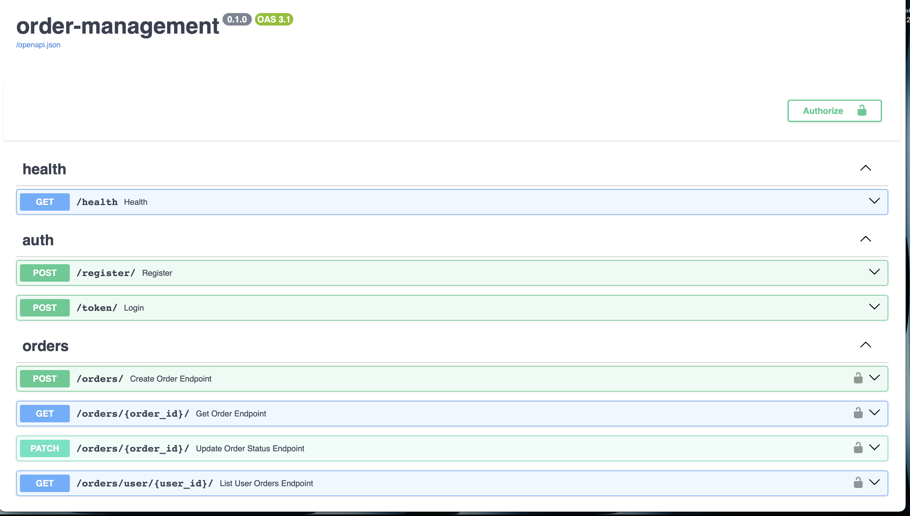
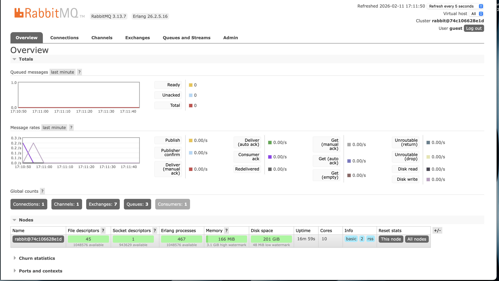
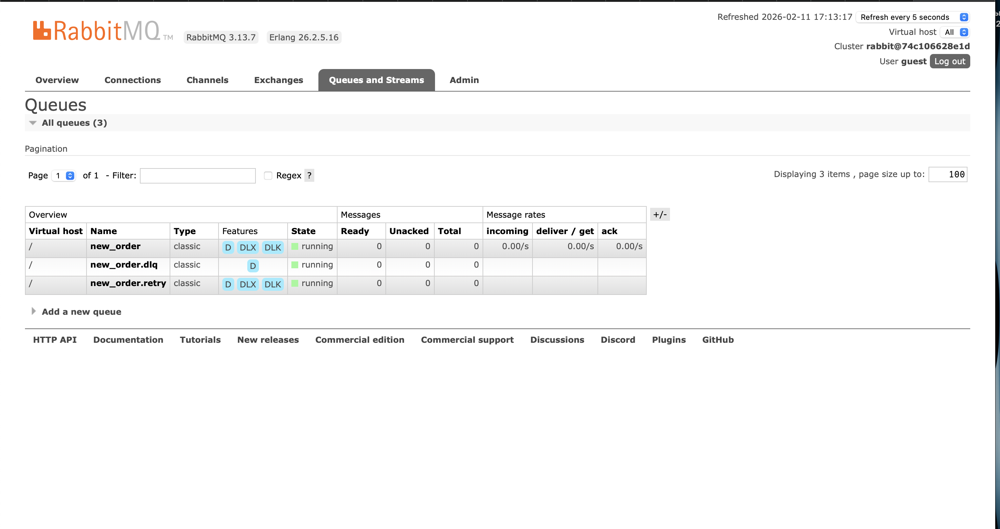

# Order Management (FastAPI)

Production-minded backend сервис для управления заказами:
- FastAPI + Swagger UI
- PostgreSQL + SQLAlchemy + Alembic миграции
- JWT auth (OAuth2 Password Flow)
- Redis cache с graceful degradation (fallback на БД)
- RabbitMQ event-bus + Outbox pattern (надёжная доставка)
- Celery фоновые задачи (отдельный брокер, по умолчанию Redis)

## Требования

- Docker + Docker Compose (рекомендуется)
- Или Python 3.12+ (локальный запуск)

## Быстрый старт (Docker) — рекомендуется

```bash
cd fastapi-order-management
cp .env.example .env
docker compose up -d --build
```

- Swagger UI: `http://localhost:8001/docs`
- Health: `http://localhost:8001/health`
- RabbitMQ UI: `http://localhost:15673` (по умолчанию `guest/guest`)

## Быстрый старт (локально)

```bash
cd fastapi-order-management
make venv
make install
cp .env.example .env
make run
```

- Swagger UI: `http://localhost:8000/docs`

## Как проверить (что может запустить ревьюер)

### Линтеры + unit tests

```bash
cd fastapi-order-management
make ci
```

### Curl сценарии (позитив + негатив)

```bash
cd fastapi-order-management
./scripts/test_api_curl_full.sh
```

### E2E: create order → outbox → RabbitMQ → consumer → Celery

```bash
cd fastapi-order-management
./scripts/test_event_flow.sh
```

## API (кратко)

### Auth

- `POST /register/` — JSON `{ "email": "...", "password": "..." }`
- `POST /token/` — `application/x-www-form-urlencoded` поля: `username` (email), `password`

### Orders (Authorization: Bearer <token>)

- `POST /orders/` — создать заказ
- `GET /orders/{order_id}/` — получить заказ (сначала Redis; fallback на БД)
- `PATCH /orders/{order_id}/` — обновить статус
- `GET /orders/user/{user_id}/` — получить список своих заказов

## Архитектура (high-level)

1) `POST /orders/` пишет `orders` + `outbox_events` в одной транзакции БД.
2) `outbox_publisher` читает pending outbox события и публикует в RabbitMQ (с ретраями).
3) `message_consumer` читает события `new_order` и запускает Celery задачу `process_order`.
4) Celery работает на отдельном брокере (по умолчанию Redis), чтобы не смешивать event-bus и task queue.

## Миграции

### Режим тестового (self-contained docker compose)

По умолчанию в `.env.example` включено:

```bash
RUN_MIGRATIONS_ON_STARTUP=true
```

Миграции запускаются один раз при старте приложения с использованием Postgres advisory lock
(`app/core/migrations.py`). Это делает `docker compose up` самодостаточным для тестового.

### Production рекомендация (типовой подход)

В production миграции обычно выполняются отдельным **deploy шагом / job**
(CI/CD step, Kubernetes Job/initContainer), а API процесс запускается без DDL прав.

Чтобы отключить миграции на старте в этом проекте:

```bash
RUN_MIGRATIONS_ON_STARTUP=false
```

После этого миграции можно прогнать явно:

```bash
cd fastapi-order-management
make migrate
```

## Полезные команды

```bash
cd fastapi-order-management
make clean        # удалить кеши/артефакты
make dc-up        # docker compose up --build
make dc-down      # docker compose down -v
make dc-logs      # tail логов compose
```

## Скриншоты (добавить перед отправкой)

### Swagger UI



### RabbitMQ (overview)



### RabbitMQ (очереди/консюмеры)


